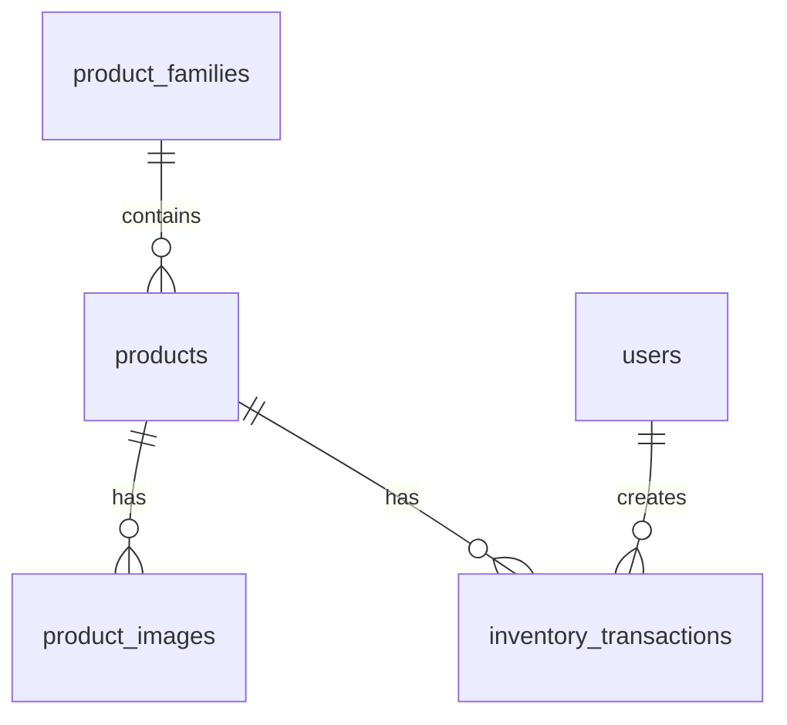

# Documentação do Banco de Dados e Importação de Dados

## Índice
1. [Estrutura do Banco de Dados](#1-estrutura-do-banco-de-dados)
   - [1.1 Tabelas Principais](#11-tabelas-principais)
   - [1.2 Diagrama do Esquema](#12-diagrama-do-esquema)
2. [Scripts de Criação do Banco de Dados](#2-scripts-de-criação-do-banco-de-dados)
   - [2.1 Esquema Inicial](#21-esquema-inicial)
   - [2.2 Dados de Exemplo](#22-dados-de-exemplo)
3. [Importação de Dados via CSV](#3-importação-de-dados-via-csv)
   - [3.1 Estrutura do CSV](#31-estrutura-do-csv)
   - [3.2 Script de Importação](#32-script-de-importação)
4. [Backup e Restauração](#4-backup-e-restauração)
   - [4.1 Criar Backup](#41-criar-backup)
   - [4.2 Restaurar Backup](#42-restaurar-backup)
5. [Migrações](#5-migrações)
6. [Considerações Finais](#6-considerações-finais)

## 1. Estrutura do Banco de Dados

### 1.1 Tabelas Principais

#### `product_families`
- Armazena as famílias/categorias de produtos
- **Campos importantes**: `id`, `code`, `name`, `description`

#### `products`
- Armazena os produtos da loja
- **Campos importantes**:
  - `reference`: Código de referência único
  - `name`: Nome do produto
  - `purchase_price`: Preço de custo
  - `sale_price`: Preço de venda
  - `current_stock`: Estoque atual
  - `min_stock`: Estoque mínimo
  - `weight`, `material`, `style`: Detalhes do produto

#### `product_images`
- Armazena as imagens dos produtos
- **Relação**: Muitas imagens para um produto

#### `inventory_transactions`
- Registra todas as movimentações de estoque
- **Tipos de transação**: 'purchase', 'sale', 'adjustment'

#### `users`
- Usuários do sistema
- Inclui um usuário admin padrão (admin/admin123)

### 1.2 Diagrama do Esquema



## 2. Scripts de Criação do Banco de Dados

### 2.1 Esquema Inicial

Arquivo: `sql/schema.sql`

```bash
# Criar banco de dados e usuário (opcional)
mysql -u root -p -e "CREATE DATABASE IF NOT EXISTS gonzagas CHARACTER SET utf8mb4 COLLATE utf8mb4_unicode_ci;"
mysql -u root -p -e "GRANT ALL PRIVILEGES ON gonzagas.* TO 'gonzagas_user'@'localhost' IDENTIFIED BY 'sua_senha';"

# Aplicar esquema
mysql -u gonzagas_user -p gonzagas < sql/schema.sql
```

### 2.2 Dados de Exemplo

Arquivo: `sql/insert_sample_products.sql`

```bash
mysql -u gonzagas_user -p gonzagas < sql/insert_sample_products.sql
```

## 3. Importação de Dados via CSV

### 3.1 Estrutura do CSV

Exemplo de `produtos.csv`:

```csv
reference,name,description,purchase_price,sale_price,current_stock,min_stock,weight,material,style
BRC001,Brinco de Prata 925,Brinco folheado a ouro 18k,25.90,49.90,10,5,5.5,Prata 925,Boho
ANL002,Anel Lua e Estrela,Anel em prata 925,35.50,79.90,5,3,8.2,Prata 925,Boho
```

### 3.2 Script de Importação

Crie o arquivo `scripts/import_products.sh`:

```bash
#!/bin/bash

# Configurações
DB_USER="gonzagas_user"
DB_PASS="sua_senha"
DB_NAME="gonzagas"
CSV_FILE="$1"
TEMP_TABLE="temp_products"

if [ -z "$CSV_FILE" ]; then
    echo "Uso: $0 <arquivo.csv>"
    exit 1
fi

if [ ! -f "$CSV_FILE" ]; then
    echo "Erro: Arquivo $CSV_FILE não encontrado"
    exit 1
fi

echo "Iniciando importação de $CSV_FILE..."

mysql -u $DB_USER -p$DB_PASS $DB_NAME << EOF
-- Criar tabela temporária
CREATE TEMPORARY TABLE $TEMP_TABLE (
    reference VARCHAR(50),
    name VARCHAR(200),
    description TEXT,
    purchase_price DECIMAL(10,2),
    sale_price DECIMAL(10,2),
    current_stock INT,
    min_stock INT,
    weight DECIMAL(10,2),
    material VARCHAR(100),
    style VARCHAR(100)
);

-- Importar dados do CSV
LOAD DATA LOCAL INFILE '$CSV_FILE'
INTO TABLE $TEMP_TABLE
FIELDS TERMINATED BY ','
ENCLOSED BY '"'
LINES TERMINATED BY '\n'
IGNORE 1 LINES;

-- Inserir/Atualizar produtos
INSERT INTO products (
    reference, name, description, purchase_price, sale_price, 
    current_stock, min_stock, weight, material, style,
    created_at, updated_at
)
SELECT 
    reference, name, description, purchase_price, sale_price,
    current_stock, min_stock, weight, material, style,
    NOW(), NOW()
FROM $TEMP_TABLE
ON DUPLICATE KEY UPDATE
    name = VALUES(name),
    description = VALUES(description),
    purchase_price = VALUES(purchase_price),
    sale_price = VALUES(sale_price),
    current_stock = VALUES(current_stock),
    min_stock = VALUES(min_stock),
    weight = VALUES(weight),
    material = VALUES(material),
    style = VALUES(style),
    updated_at = NOW();

-- Registrar transações de estoque iniciais
INSERT INTO inventory_transactions (
    product_id, transaction_type, quantity, unit_price, 
    total_amount, notes, created_by, created_at
)
SELECT 
    p.id, 'purchase', t.current_stock, t.purchase_price,
    (t.current_stock * t.purchase_price), 'Carga inicial', 'sistema', NOW()
FROM $TEMP_TABLE t
JOIN products p ON t.reference = p.reference;

-- Limpar tabela temporária
DROP TEMPORARY TABLE IF EXISTS $TEMP_TABLE;
EOF

echo "Importação concluída com sucesso!"
```

**Uso:**
```bash
chmod +x scripts/import_products.sh
./scripts/import_products.sh caminho/para/produtos.csv
```

## 4. Backup e Restauração

### 4.1 Criar Backup

```bash
# Criar diretório de backups
mkdir -p db_backups

# Criar backup completo (incluindo estrutura e dados)
BACKUP_FILE="db_backups/gonzagas_backup_$(date +%Y%m%d_%H%M%S).sql"
mysqldump -u gonzagas_user -p --routines --triggers --single-transaction gonzagas > "$BACKUP_FILE"

# Compactar o backup
gzip "$BACKUP_FILE"
echo "Backup criado: ${BACKUP_FILE}.gz"
```

### 4.2 Restaurar Backup

```bash
# Descompactar se necessário
if [[ "$1" == *.gz ]]; then
    gunzip -c "$1" > "${1%.gz}"
    BACKUP_FILE="${1%.gz}"
else
    BACKUP_FILE="$1"
fi

# Restaurar
mysql -u gonzagas_user -p gonzagas < "$BACKUP_FILE"
echo "Backup restaurado de $BACKUP_FILE"
```

## 5. Migrações

O sistema inclui migrações para atualizações futuras do esquema:

```
database/migrations/
├── core/
│   └── 001_create_admin_users.sql
├── inventory/
│   ├── 001_create_products.sql
│   └── 002_create_inventory.sql
└── purchasing/
    └── 001_create_suppliers.sql
```

**Aplicar migrações:**

```bash
# Criar script apply_migrations.sh
echo "Aplicando migrações..."
for migration in $(find database/migrations -name "*.sql" | sort); do
    echo "Aplicando $migration"
    mysql -u gonzagas_user -p gonzagas < "$migration"
done
echo "Migrações concluídas"
```

## 6. Considerações Finais

### Segurança
- 🔒 Nunca armazene senhas em arquivos de script
- 🔑 Use variáveis de ambiente para credenciais
- 📁 Restrinja as permissões dos arquivos de backup

### Desempenho
- ⚡ Para grandes volumes de dados, use `--disable-keys` no mysqldump
- 🔄 Desative índices durante a importação e reative após

### Monitoramento
- 📝 Verifique os logs de erro do MySQL após importações
- 💾 Monitore o espaço em disco durante operações de backup/restore

### Versionamento
- 🔄 Mantenha os scripts SQL versionados
- 📝 Documente todas as alterações no esquema

### Dicas para Desenvolvimento
1. Sempre teste os scripts em um ambiente de desenvolvimento primeiro
2. Faça backup antes de executar operações de migração
3. Documente quaisquer alterações manuais feitas no banco de dados
